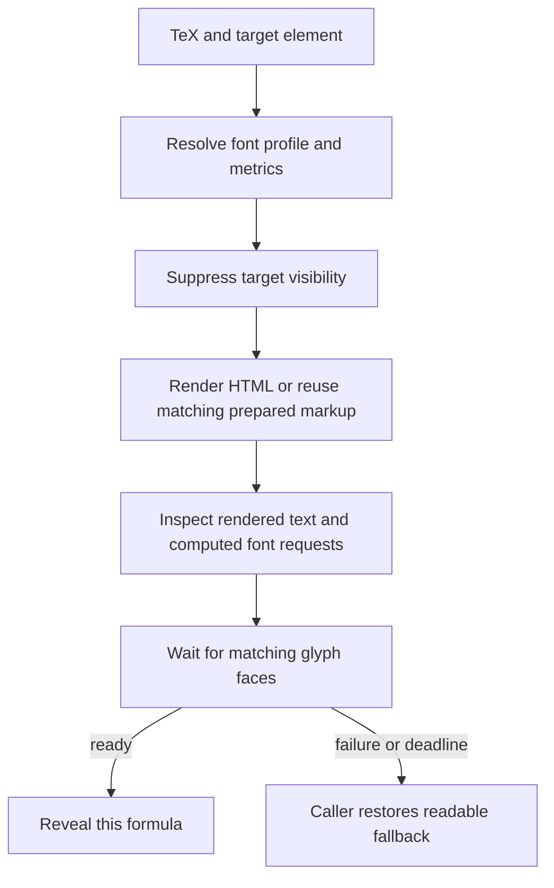

# Architecture: Font and Math Loading

**Date:** 2026-09-08

**Status:** Approved.

## Overview

This is the architectural home for KPress font selection, mathematical layout, font
readiness, and optional host-prepared geometry.
The [host API reference](../../math-rendering-api.md) defines method signatures and
public attributes. [KPress Design](../../kpress-design.md#math-text-face) retains the
font construction details and earlier measurements.

Three operations happen at different times: producing mathematical markup, decoding the
fonts that draw it, and reserving its final dimensions.
Correct markup and embedded font bytes alone do not make all three synchronous.

## Goals and Boundaries

Mathematical letters and digits should agree with the surrounding reading face, while
KaTeX retains its mathematical symbols and layout.
A formula should first appear with matching glyphs and metrics.
Hosts that need stable initial layout can reserve its final space before client scripts
execute. Failures must leave readable mathematics.

Ordinary KPress HTML generation remains browser-free.
Exact initial geometry is an optional host responsibility; KPress does not impose a
browser or a second layout engine on every publisher.
Dynamic input can legitimately produce a differently sized formula.

## System Context

| Owner | Responsibility | Code entry point |
| --- | --- | --- |
| Python renderer | Emit TeX, semantic MathML, and the required asset set | [`format/render.py`](../../../src/kpress/format/render.py), [`format/markdown.py`](../../../src/kpress/format/markdown.py) |
| Reading typography | Select prose, sans, and print faces | [`style-tokens.css`](../../../src/kpress/format/static/css/style-tokens.css) |
| Static sans generator | Read the regular-weight token, instance print faces, and emit their declarations | [`instance_sans.py`](../../../devtools/instance_sans.py), [`print-fonts.css`](../../../src/kpress/format/static/css/print-fonts.css) |
| Math font CSS | Compose reading-face glyphs with KaTeX glyphs | [`katex-text-face.css`](../../../src/kpress/format/static/katex/katex-text-face.css) |
| Metric generator | Derive KaTeX metric tables from shipped font assets | [`katex_text_metrics.py`](../../../devtools/katex_text_metrics.py) |
| Shared runtime | Select matching metrics, render or hydrate, await font readiness | [`katex-math-runtime.js`](../../../src/kpress/format/static/katex/katex-math-runtime.js) |
| Native initializer | Enhance the document’s own math nodes and finish the page barrier | [`katex-init.js`](../../../src/kpress/format/static/katex/katex-init.js) |
| PDF exporter | Switch to print, await document and margin-box family/weight requests, and emit Chromium PDF | [`format/pdf.py`](../../../src/kpress/format/pdf.py) |
| Regression gates | Check generated metrics and faces, delayed loads, media state, and PDF embedding | [`test_katex_text_metrics.py`](../../../tests/test_katex_text_metrics.py), [`test_playwright_math_loading.py`](../../../tests/test_playwright_math_loading.py), [`test_playwright_sans_math_face.py`](../../../tests/test_playwright_sans_math_face.py), [`test_playwright_print_pdf_fonts.py`](../../../tests/test_playwright_print_pdf_fonts.py) |
| Embedding host | Prepare geometry, manage dynamic content, and coordinate exports | [Host API reference](../../math-rendering-api.md) |

## Design

### Fonts and metric tables

`KPress Math Text` and `KPress Math Text Sans` are CSS composite families over separate
font files. They are not merged font binaries.
Unicode ranges route Latin letters and digits to PT Serif or Source Sans; mathematical
characters use the appropriate KaTeX faces.
Explicit math alphabets and large constructs can request additional KaTeX faces.
Embedding these files as data URIs removes network requests, but the browser still has
to parse CSS, choose faces, and decode font data.

KaTeX needs numerical metrics before it produces HTML. The runtime selects `prose`,
`sans`, or `katex` from the containing context and explicit opt-outs, installs that
table, performs layout synchronously, then restores the shared default tables.
The synchronous section prevents two pending renders from mixing metric profiles.
Changing only CSS while leaving the wrong table installed would change the glyphs
without correcting fractions, scripts, spacing, or line dimensions.

The regular sans weight has one build-time input: `--kpress-font-weight-sans-regular` in
`style-tokens.css`, currently 410. The existing instancer and metric generator read it
to produce matching screen descriptors, static print faces, Greek scales and KaTeX
tables. Regular prose uses the token; mathematics uses the generated fixed weight,
including normal and italic slots.
Changing only a live prose override does not regenerate those mathematical metrics.
Medium and bold keep their separate weights.

A missing composite declaration selects stock KaTeX families with stock metrics.
A declared font that fails to load is a different case: the runtime reports failure and
lets the caller expose its readable fallback.
An unused failed weight does not invalidate a formula whose requested glyph faces
loaded.

### Runtime rendering and readiness

`render()` creates hidden markup immediately.
For each rendered glyph run, the runtime requests each family in its computed fallback
list separately through `document.fonts.load()`, using that run’s style, weight, size
and characters.
It awaits those cached native load promises before revealing the formula.
An empty result means that family has no matching declared face for the sample; later
families are awaited independently.
`FontFaceSet.check()` is not a readiness gate: WebKit can report true while a matching
face’s load promise remains pending, even for a request naming one family.
The cross-browser regression suite covers this distinction.

Each target has a version counter.
An older pending request resolves as `superseded` and cannot reveal or overwrite a newer
request.
A three-second deadline bounds a failed font wait; it is a recovery ceiling, not
a scheduled startup delay.
Load requests are cached, with screen and print requests kept separate.

`ready()` is an explicit broad warmup API. Native enhancement, `render()`, and
`hydrate()` do not invoke it automatically.
A host may request it for a deliberate batch, but putting it ahead of every formula
delays that formula on unrelated slots.

### Publication preparation and hydration

Plain KaTeX HTML has vertical struts, but its text still has intrinsic glyph widths.
Hiding that HTML prevents a visible font swap; it does not freeze its width.
Publishing only `renderToString()` output therefore cannot guarantee that neighboring
text stays in place while fonts decode.

A host can render its initial math under the actual publication CSS in a pinned browser,
wait for the intended fonts, and measure each unbreakable KaTeX `.base`. It reserves
that base’s width, height, and baseline offset, usually in em units, and keeps the
selectable math HTML inside.
Separate boxes preserve KaTeX’s breaks between bases.
Reserving a whole formula as one inline block would remove those breaks.

The reservation and its visible glyphs must share a baseline.
Empty inline wrappers still contribute font-dependent line boxes, as specified by
[CSS line-height calculations](https://www.w3.org/TR/CSS22/visudet.html#line-height).
An unchanged outer rectangle therefore does not prove that glyphs inside it remain
aligned when print changes the font size.
For a host that positions each `.base` absolutely inside its reservation:

- Measure the ordinary, fully loaded base’s width, total height, and depth below its
  baseline before changing its line height.
- Copy that same measured height and negative depth, in em units, onto the prepared
  clone’s existing direct `.strut` as `height` and `vertical-align`.
- Set `line-height: 0` on the prepared `.base` and its enclosing `.katex` and
  `.katex-html` carriers.
  The measured strut supplies the baseline geometry; empty carriers must not add a
  second font-dependent line height.

Keep these changes scoped to prepared content.
Ordinary rendering and readable fallbacks retain KaTeX’s normal layout.
Setting zero line height alone is insufficient: a punctuation-only base can have a
smaller original KaTeX strut than the ordinary font line box it occupied.
Copying the measured extent preserves that space too.

The geometry must cover every saved font setting the host supports.
A reader’s choice of custom or system fonts and serif or sans prose can change the
resolved math profile and its dimensions.
Preparing only the publisher’s default leaves other readers on the normal-render path,
where hidden glyphs still change width as fonts arrive.

A host can publish measured variants and select the matching one declaratively from the
root attributes applied by the head bootstrap.
Exactly one variant should participate in layout before the first paint; inactive
variants must also stay out of the accessibility tree.
Preserve a readable default when JavaScript is disabled.
Variants with identical markup and geometry can share one copy.
Keep profile metadata on each actual render target; an ancestor must not force another
variant’s face onto it.
Hydrate the selected target with its matching source and options.
Choosing a matching variant only after client rendering starts cannot protect earlier
layout from the default variant’s dimensions.

The host writes only the prepared math fragments and their geometry back into its
original HTML. It should not serialize transient canvas state, tooltips, observer
mutations, or the browser’s entire modified document.
The publication renderer remains the single writer of the output artifact.

`render()` stamps source, display mode, and resolved profile.
The preparation step adds the prepared marker.
`hydrate()` reuses the existing DOM only when those values match the request; otherwise
it rerenders. The host must keep the KaTeX bundle, metrics, CSS, macros, and remaining
rendering options consistent with its preparation pass.
These attributes describe a host-produced artifact; they do not authenticate arbitrary
HTML or enable KaTeX’s trusted-content options.

### Visibility, fallback, and exports

The head bootstrap marks pending enhancement early enough to suppress a native-math
flash. The runtime also hides individual render targets while their required fonts are
pending. Hosts may release each completed formula independently.
A page-wide completion marker is useful for export tools, but should not keep an
already-ready formula hidden until unrelated work finishes.

Without JavaScript, ordinary KPress shows semantic MathML. A prepared host can instead
show its selectable KaTeX HTML while retaining visually clipped MathML for
accessibility. If enhancement fails, the caller must restore its fallback state as well
as its text; an old `data-kpress-math-rendered` marker can otherwise keep semantic
MathML clipped.

Print changes the font cascade.
Export tools must wait for math requests and print faces after switching media.
Reservations in em units scale with the formula’s computed font size.
Reusing them for print also requires equivalent glyph advances and the explicit baseline
geometry described above.
KPress’s static sans math instances preserve the screen face’s advances; matching font
files alone does not establish baseline agreement inside host reservations.
A host whose print styling changes the math profile or relative dimensions must prepare
matching print geometry; waiting for fonts alone does not correct an incompatible
reservation. Host canvas work also needs an explicit completion path: deferring a heat
map on screen must not omit it from a PDF. Print visibility is determined by computed
CSS, which can differ from an element’s `hidden` attribute.

## Trade-offs and Alternatives

Prepared geometry adds publication work and HTML bytes in exchange for stable initial
space and less client layout work.
Its dimensions must be verified in supported browsers and print styles.
Hosts retain a normal-render path for changed input and mismatched profiles.

Broadly preloading all styles simplifies readiness but downloads or decodes unused
faces. Rendering hidden markup first provides the glyph requests needed for a narrower
wait. Merely hiding raw TeX or MathML reserves the fallback’s dimensions, which can be
different. Summing KaTeX private-tree width fields is also insufficient: combined text
nodes can retain a single glyph’s width rather than the entire run’s advance.

## Operational Checks

Correctness and performance have separate probes.
Correctness checks should establish:

- At each formula’s first visible frame, its matching glyph fonts are ready and the
  selected metrics agree with the intended prose or sans context.
- Required-font failure, missing declarations, explicit opt-outs, early repeated input,
  no-JavaScript output, and print all preserve their contracts.
- Each supported saved font setting selects matching prepared content before the first
  paint. Run coverage and geometry checks under that setting in each supported browser
  and print style.
- Enumerate the mathematical bases that should occupy layout and require a reservation
  for each one. Scanning only surviving reservation wrappers misses a formula whose
  entire prepared wrapper disappeared during profile fallback.
- Prepared boxes retain position, dimensions, and line breaks through genuinely delayed
  font loads, and final reserved widths agree with final intrinsic widths.
- After painting, measure the actual inline math baseline against adjacent text with
  baseline-aligned, zero-size markers.
  Check screen and print sizes and compare the same TeX rendered with and without
  preparation; unchanged outer box coordinates are not enough.
  Include punctuation-only bases, scripts, fractions, radicals, limits, and zero-height
  constructs such as `\smash{x}` and `\quad`.
- Negative controls are rejected: an unavailable glyph shown early, a missing box width,
  a missing entire reservation, a consistently wrong reserved width, and stale print or
  fallback state. Baseline checks must also reject restoring the original font line strut
  or shifting the visible glyphs while leaving their reservation unchanged.

Normal startup measurements must leave font loads and input untouched.
Record the first correct visible parameter set, adjacent-text movement, viewport, cache
regime, browser, source revision, and observer overhead.
Compare frozen control and candidate artifacts on the same regime.
An artificially delayed-font correctness test is not a normal-load latency benchmark.

Squares implements the optional publication path in its `prepare_explainer_math.py`
helper. It also emits the default certificate figures in the original HTML, hydrates
initial parameter values, reveals completed formulas independently, and schedules screen
heat maps after math settles.
Its Pages workflow checks the same prepared artifact in Chromium, Firefox, and WebKit
before deployment.

## References

- [Rendering Mathematics in a Host](../../math-rendering-api.md)
- [KPress Design: Math Text Face](../../kpress-design.md#math-text-face)
- [Vendored Fonts](../../../src/kpress/format/static/fonts/README.md)
- [Math Text Face Research](../research/research-2026-09-07-math-text-face.md)
- [Sans Math Face Research](../research/research-2026-09-07-sans-math-face.md)
- [Print Sans Faces Research](../research/research-2026-09-07-print-sans-faces.md)
- [Publication-Quality PDF Output Research](../research/research-2026-09-05-print-ready-pdf-output.md)

<!-- This document follows common-doc-guidelines.md.
See github.com/jlevy/practical-prose and review guidelines before editing.
-->
