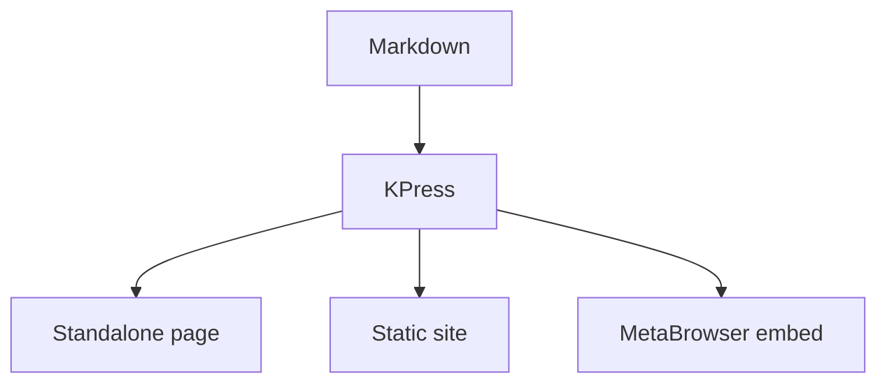

# KPress Reader Showcase

This document is the manual end-to-end review surface for the KPress reader. Every
section below maps to a feature in `kpress-reader-features.md` and to a heading in
`docs/kpress-e2e-testing.runbook.md`. Walk it top to bottom in a browser and confirm each
behaves as the runbook describes.

The second page, [Reference](reference.html), exists so you can test cross-page navigation
and a print-heavy ordered list. A longer page, [Airspeed Velocity](airspeed-velocity.html),
is a multi-section academic document for exercising the TOC, footnotes, tables, and scroll
behavior at length.

## Typography and the type scale

This paragraph is long-form serif body copy so you can judge the reading measure, line
height, and color. It sits in a centered reading column. Inline styles: **bold**,
_italic_, ***bold italic***, `inline code`, ~~strikethrough~~, and a
[link to a later heading](#tables) for an internal-link tooltip.

### Heading level 3

Subsections step down in size and weight following the type scale.

#### Heading level 4

The smallest heading still reads as a heading, not body text.

> A blockquote. It should be visually set off from body text with its own color and
> indent, and remain readable in both light and dark themes.

## Lists and tasks

- Top-level unordered item
  - Nested item one
  - Nested item two
    - Third level
- Back to the top level

1. First ordered item
2. Second ordered item
3. Third ordered item

Task list:

- [x] Rendered standalone
- [x] Built as a static site
- [ ] Reviewed in dark mode
- [ ] Checked print preview

## Links and link policy

- Internal anchor: [jump to Code](#code-and-copy) (smooth scroll + tooltip on hover).
- External link: [lucide.dev](https://lucide.dev) should open in a **new tab** with
  `rel="noopener noreferrer"`.
- Autolink: <https://example.com> is linkified in place.
- Mail link: <mailto:hello@example.com> is left as a normal mail link.

## Footnotes

Footnotes render as superscript numbers that match the definitions at the bottom: the
first claim,[^one] a second point,[^two] and a third.[^three] Hover or focus a marker to
preview its content in a solid-background tooltip; the markers also back-reference.

## Tables

A normal table with numeric cells (headers small-caps, zebra rows, numbers
right-aligned):

| Metric | Q1 | Q2 | Q3 |
| --- | ---: | ---: | ---: |
| Revenue | 1,200 | 1,455 | 1,610 |
| Growth | 4.2 | 7.8 | 10.5 |
| Active | 320 | 511 | 980 |

A **wide** table to exercise horizontal scroll on narrow widths and the TOC-aware desktop
breakout:

| Region | Jan | Feb | Mar | Apr | May | Jun | Jul | Aug | Sep | Oct | Nov | Dec |
| --- | ---: | ---: | ---: | ---: | ---: | ---: | ---: | ---: | ---: | ---: | ---: | ---: |
| North | 11 | 12 | 14 | 13 | 16 | 19 | 22 | 21 | 18 | 15 | 13 | 12 |
| South | 21 | 19 | 18 | 17 | 16 | 15 | 14 | 16 | 18 | 20 | 22 | 24 |
| East | 31 | 33 | 35 | 34 | 36 | 38 | 40 | 39 | 37 | 35 | 33 | 32 |

## Code and copy

Code blocks are syntax-highlighted (light and dark stylesheets) and each carries a copy
icon control (not a text "Copy" box).

```python
def fib(n: int) -> int:
    a, b = 0, 1
    for _ in range(n):
        a, b = b, a + b
    return a
```

```bash
kpress render doc.md --output out.html --asset-mode hashed
```

```js
const ready = (id, w, h) => postMessage({ type: "kpress:ready", id, w, h });
```

## Math

Inline math $a^2 + b^2 = c^2$ flows with prose. Display math renders as a block:

$$
\int_0^1 x^2 \, dx = \tfrac{1}{3}
$$

A document with no math loads no math assets; this one should lazily load KaTeX only
because math is present.

## Diagrams

A Mermaid fence (progressive render with a readable source fallback):



An inline SVG fence (sanitized inline figure):

```svg
<svg viewBox="0 0 160 50" role="img">
  <title>Inline SVG diagram</title>
  <rect x="1" y="1" width="158" height="48" fill="none" stroke="currentColor"></rect>
  <text x="16" y="30" font-family="sans-serif" font-size="14">KPress SVG fence</text>
</svg>
```

## Images and figures

A standalone image becomes a semantic `<figure>` with a `<figcaption>`:


A captured frame uses the `frame-capture` treatment:

{.frame-capture}

## Details and raw HTML

<details><summary>Expand for trusted-local HTML</summary><p>This collapsible block is
authored as trusted-local raw HTML and should render inline with the reader's details
styling, and have a sensible print policy.</p></details>

## Semantic blocks

Inline semantic spans: [Important]{.highlight} and [Reference]{.citation}.

{.subtitle}
A subtitle styled like the reader's compact subtitle.

::: hero
# Hero _Signal_
:::

:::: key-claims
::: claim
First claim, with enough prose to exercise the claim marker treatment.
:::

::: claim
Second claim remains a peer block inside the key-claims surface.
:::
::::

::: summary
A summary block in the reader's compact sans treatment.
:::

::: concepts
- Alpha
- Beta
- Gamma
:::

:::: annotated-para
::: para-caption
Caption beside the paragraph on wide screens.
:::

::: para
The annotated paragraph body stays readable beside the caption and stacks on narrow
screens.
:::
::::

::: boxed-text
Boxed copy that should avoid page breaks in print.
:::

::: centered-headers
## A centered section heading
:::

::: justify
This justified paragraph aligns as justified body copy while leaving the final line flush
left, which lets you confirm the justify treatment without ragged-right edges.
:::

## Tabs

:::: tabs
::: tab Overview
Overview panel content. Tabs hydrate into an ARIA tablist with keyboard support; print
shows every panel with its title.
:::

::: tab Details
Details panel content, revealed when you activate the second tab.
:::

::: tab Notes
A third panel to confirm more than two tabs work.
:::
::::

## Video

A YouTube watch link is intercepted into a no-network placeholder that opens a
focus-trapped dialog: [Watch the demo](https://www.youtube.com/watch?v=dQw4w9WgXcQ).

A raw embed in a gallery behaves the same and makes no eager network call until clicked:

:::: video-gallery
::: video-item
<iframe src="https://www.youtube.com/embed/dQw4w9WgXcQ" title="Demo video"></iframe>
:::
::::

[^one]: First footnote — exercises numbering, the hover tooltip, and print simplification.
[^two]: Second footnote — confirm this is marker number 2 in both the body and the list.
[^three]: Third footnote — with an [internal link](#typography-and-the-type-scale) inside
    the definition.
