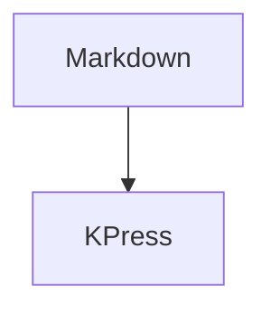

# Rich Components

Intro paragraph with an [internal link](#details) and a note.[^note]

## Tasks

- [x] Port theme behavior
- [ ] Review print output

## Table

| Feature | Status |
| --- | --- |
| TOC | active |
| Print | active |

## Code

```js
console.log("kpress");
```

## Math

Inline math $a^2 + b^2$ and display math:

$$
E = mc^2
$$

## Diagram



```svg
<svg viewBox="0 0 120 40" role="img">
  <title>Inline SVG diagram</title>
  <rect x="1" y="1" width="118" height="38" fill="none" stroke="currentColor"></rect>
  <text x="12" y="25">KPress SVG</text>
</svg>
```

## Details

<details><summary>More</summary><p>Trusted local HTML.</p></details>

[^note]: Footnote content for hover and print behavior.
